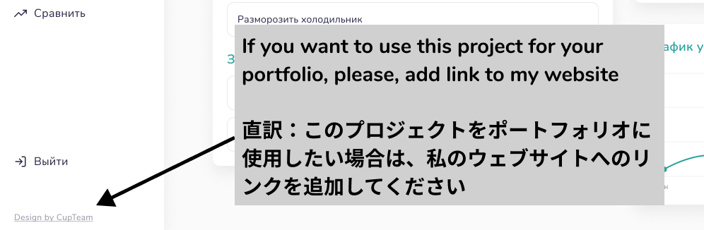

# 仕様書

# 概要

---

タスクの管理アプリ

ReactとReact Routerを用いてSPA(ログインページと操作ページ)を実装

# デザイン概要

[https://www.figma.com/embed?embed_host=notion&url=https%3A%2F%2Fwww.figma.com%2Ffile%2FRcvZ3rf2KkE3vzIwbBtjEE%2FSPA-TasksBook-%255C-Todos-(Community)%3Fnode-id%3D0%253A1](https://www.figma.com/embed?embed_host=notion&url=https%3A%2F%2Fwww.figma.com%2Ffile%2FRcvZ3rf2KkE3vzIwbBtjEE%2FSPA-TasksBook-%255C-Todos-(Community)%3Fnode-id%3D0%253A1)

---

# GitHub リポジトリ

[GitHub - GrowUp-Haruno/react-todo-evolution: Issueをフル活用してReact/todoを進化させていく](https://github.com/GrowUp-Haruno/react-todo-evolution.git)

# 技術構成

---

## フロントエンド

---

- React
- React Router
- CSS Grid
- Styled Components
- Chakra UI

## バックエンド(Firebase)

---

- Realtime Database
- Authentication

## 調査中

---

- グラフ機能
- リアルタイム表示
- カレンダー表示

# フロントエンド構成

---

- それぞれをSPAとして構成する
    - ログイン機能を有するログインページ
    - Todoなどの情報を表示する操作ページ

# バックエンド構成

---

- Firebase Authenticationを用いてログイン機能を実装する
- ログイン状態の場合、Firebase Realtime Databaseから情報を取り出してい表示する
    - データベースの構築次第ではRealtime Databaseから別の技術を使用する

# 注意事項

---

Figmaのコミュニティデザインを使用しているため、下記の内容を記述すること

- 作者様のウェブサイトへのリンク
    
    
    

文字列：Design by CupTeam

URL: [https://cupteam.space/](https://cupteam.space/)

[Головна CUPTeam WEB Design Studio * Студія веб дизайну - Створення сайтів для Вас!](https://cupteam.space/)

- Creative Commonsのライセンス表示

[Creative Commons - 表示 4.0 国際 - CC BY 4.0](https://creativecommons.org/licenses/by/4.0/deed.ja)